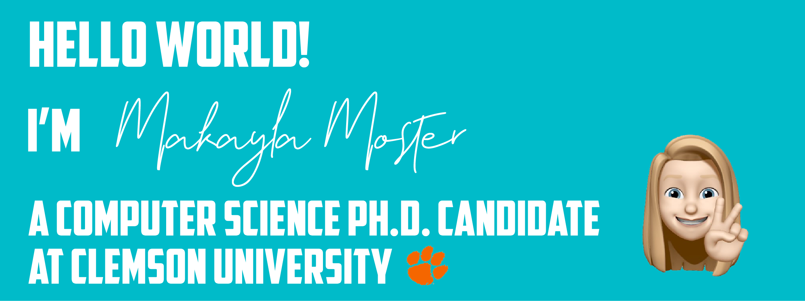

<!-- ### Hi there 👋 -->

<!--
**makayla-moster/makayla-moster** is a ✨ _special_ ✨ repository because its `README.md` (this file) appears on your GitHub profile.

Here are some ideas to get you started:

- 🤖 I’m currently working on ...
- 🌱 I’m currently learning ...
- 👯 I’m looking to collaborate on ...
- 🤔 I’m looking for help with ...
- 💬 Ask me about ...
- 📫 How to reach me: ...
- 😄 Pronouns: ...
- ⚡ Fun fact: ...
-->

<h3>Hello there! 👋 I'm Makayla Moster, Ph.D. CS Ph.D. Candidate @ Clemson University  Incoming Assistant Professor @ UNCW </h3>

<!---->

 
  
  [![Website][website-shield]][website-url]
  [![Twitter][twitter-shield]][twitter-url] 
  [![LinkedIn][linkedin-shield]][linkedin-url]
  [![Email Me][email-shield]][email-url] 
  
  

<!-- MARKDOWN LINKS & IMAGES -->
<!-- https://www.markdownguide.org/basic-syntax/#reference-style-links -->
[website-shield]: https://img.shields.io/badge/-makayla--moster.github.io-green?style=flat-square&logo=github&logoColor=white&link=https://makayla-moster.github.io/
[website-url]: https://makayla-moster.github.io/
[twitter-shield]: https://img.shields.io/badge/-@makaylamoster-blue?style=flat-square&logo=Twitter&logoColor=white&link=https://twitter.com/makaylamoster
[twitter-url]: https://twitter.com/makaylamoster 
[linkedin-shield]: https://img.shields.io/badge/-Makayla%20Moster-blue?style=flat-square&logo=Linkedin&logoColor=white&link=https://www.linkedin.com/in/mmoster/
[linkedin-url]: https://www.linkedin.com/in/mmoster/
[email-shield]: https://img.shields.io/badge/-mmoster@clemson.edu-red?style=flat-square&logo=Gmail&logoColor=white&link=mailto:mmoster@clemson.edu
[email-url]: mailto:mmoster@clemson.edu
